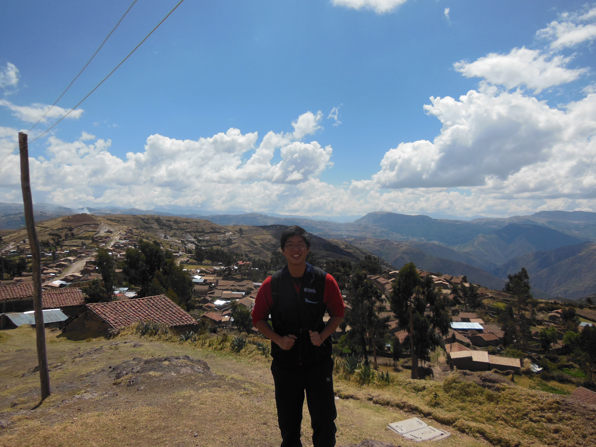

```{r setup, include=FALSE, cache = T}
knitr::opts_chunk$set(echo = FALSE)
lapply(c("data.table", 
         "ggplot2",
         "doParallel",
         "foreach", 
         "parallel", 
         "dplyr",
         "readr",
         "maptools",
         "tidyr",
         "rgeos", 
         "rgdal",
         "maptools",
         "ggmap",
         "scales",
         "electionsBR",
         "doParallel"), require, quietly = T, character.only = T)
path <- "C:/Users/galil/Google Drive/Princeton/Dissertation/Database/Database Municipios Brazil/RAIS/"
set.seed(1789)

# Repositories
states <- c("AC", "AL", "AM", "AP", "BA", "CE", "DF", "ES", "GO",
            "MA", "MG", "MS", "MT", "PA", "PB", "PE", "PI", "PR",
            "RJ", "RN", "RO", "RR", "RS", "SC", "SE", "SP", "TO")
years <- 1998:2015

rais.mun <- read_csv("C:/Users/galil/Google Drive/Princeton/R/RAIS/rais_mun/rais_mun.csv")
mun.elec <- read_csv("C:/Users/galil/Google Drive/Princeton/R/RAIS/tse/tse.csv")

## Harmonizing datasets: TSE and IBGE
rais.mun <- read_csv(file = "C:/Users/galil/Google Drive/Princeton/Dissertation/Database/Database Municipios Brazil/TSE/mun_id_br.csv") %>%
  select(tse_code, ibge6_code) %>%
  rename(mun_id = ibge6_code) %>%
  inner_join(., mun.elec, by = "tse_code") %>%
  ungroup %>%
  select(., -tse_code) %>%
  group_by(mun_id) %>%
  select(mun_id, year, party) %>%
  mutate(party = as.factor(party)) %>%
  spread(year, party) %>% #transforming to wide form
  setNames(c('mun_id', 'party.2000', 'party.2004', 'party.2008', 'party.2012')) %>%
  inner_join(., rais.mun, by = "mun_id")

## Merging RAIS dataset with the PNUD dataset:
pnud.mun.2000 <- 
  read_csv(file = "C:/Users/galil/Google Drive/Princeton/R/Censo/censo_pnud_eng.csv") %>%
  filter (year == 2000) %>%
  left_join(filter(rais.mun, year == 2000), ., by = "mun_id")
```

## 



##


## Outline of Presentation

- The Debate: Unpacking State Capacity

- Local Administrative Capacity

- Identification Strategy: Mayor Partisanship

## The Debate: Unpacking State Capacity
* State capacity is a multidimensional concept:
		+ Extractive capacity (Kurtz 2013, Centeno 1997)
    + Infrastructural power (Soifer 2008)
    + Administrative capacity (Kohli 2004, Evans 2012)

* Focus on administrative capacity:
    + Educational levels of bureaucrats.
    + "Beyond taxation, another critical measure of [state] capacity is the level of education and professionalization of government officials." (Fukuyama 2013)
    
* How to measure it?
    + Bureaucrats working in the administrative staff of the executive branch.
    + Average educational levels of bureaucrats by municipality.
    
## Histogram of Educational Levels of Bureaucrats

```{r, echo=FALSE, cache=T, fig.width=4, fig.height=3, fig.align='center',  dpi = 600}
ggplot(data = filter(rais.mun, year == 2000), aes(x = mean.edu)) +
  geom_histogram(aes(fill = ..count..), binwidth = 0.1) +
  ggtitle("Histogram of municipal bureaucrat's \n educational levels (2000)") +
  xlab("Average education level in municipality") + ylab("Frequency")
```

## Local Administrative Capacity
* Decentralization delegates to local governments:
    + Public goods delivery (health, education).
* Municipal bureaucrats outnumber national and state-level.
    + Also responsible for implementing public policy.
* Municipal variation in the average educational levels of bureaucrats:
    + O'Donnell (1993): Green and brown areas.

## Growth in the number of municipal bureaucrats
```{r, echo=FALSE, cache=T, fig.width=5, fig.height=3, fig.align='center',  dpi = 400}
# Plot for bureaucracy at different levels of gov't
year <- c(1992, 1995, 1997, 1998, 1999, 2002, 2003, 2004, 2006, 2007, 
          1992, 1995, 1997, 1998, 1999, 2002, 2003, 2004, 2006, 2007,
          1992, 1995, 1997, 1998, 1999, 2002, 2003, 2004, 2006, 2007)
perc <- c(round(2666/7505*100, 2), round(2958/7843*100, 2), round(3030/7700*100, 2), 
       round(3228/7949*100, 2), round(3333/7927*100, 2),  47.62, 47.91, 49.54, 49.16, 50.67,
       3362/7595*100, 3442/7843*100, 3274/7700*100, 3177/7949*100, 3154/7927*100, 37.9,
       37.4, 36, 35.7, 34.1, 1477/7595*100, 1443/7843*100, 1396/7700*100, 1544/7949*100, 1440/7927*100, 14.5,
         14.7, 14.5, 15.1, 15.2)
level <- c(rep("mun", 10), rep("state", 10), rep("fed", 10))

data <- as.data.frame(cbind(year, perc, level))
data$perc <- data$perc %>% as.character %>% as.double
data$level <- factor(data$level, levels = c("fed", "state", "mun"), labels = c("Federal", "State", "Municipal"))
                      
rm(year, perc, level)

ggplot (data, aes(x = year, y = perc, group = level)) + geom_line(aes(color = level), size = 1) +
 scale_y_continuous(name = "Percentage", breaks = seq(10,60, 10)) + xlab("Year") +
  ggtitle('Proportion of bureaucrats \n by sphere of government (1992 - 2007)')
```

##

```{r, echo = F, cache = T, fig.width=9, fig.height=7, fig.align='center', warning = F, dpi = 600, message= F}
## Making map
map.mun <- readOGR(dsn = "C:/Users/galil/Google Drive/ArcGIS/Brazil", layer = "mun_2000_br", 
                   verbose = F)
proj4string(map.mun) <- CRS("+init=epsg:31983") #Change projection to SIRGAS 2000

# Modifying names
map.mun@data <- map.mun@data %>%
  mutate(NOME = NOME %>% as.character %>% toupper, id = row.names(map.mun))

## Converting map to ggplot
map.mun <- fortify(map.mun) %>%
  left_join(., map.mun@data, by = "id") %>%
  select(long, lat, group, CODIGO, NOME) %>%
  rename(mun_id = CODIGO) %>%
  mutate(mun_id = mun_id %>% as.character %>% as.integer)

# Joining with RAIS
# Obtaining wide-form edu
rais.edu <- rais.mun %>% 
  group_by(mun_id) %>% 
  select(mun_id, year, mean.edu) %>% 
  spread(year, mean.edu) %>%
  setNames(c('mun_id', paste0('edu_', 1998:2015)))

map.edu <- map.mun %>%
  left_join(., rais.edu, by = "mun_id") %>%
  mutate(edu_diff = (edu_2015 - edu_2000)/edu_2000*100)

ggplot() +
  geom_polygon(data = map.edu, aes(x = long, y = lat, group = group, fill = edu_2000),
               color = NA) +
  scale_fill_distiller(palette = "RdBu",
                       breaks = pretty_breaks(n = 8)) +
  guides(fill = guide_legend(reverse = F)) +
  labs (fill = "Edu") +
  theme_nothing(legend = TRUE) +
  xlim(range(map.edu$long)) + ylim(range(map.edu$lat)) +
  coord_map() +
  ggtitle("Bureaucratic educational levels: \n municipal average (2000)")
```

##

```{r, echo = F, cache = T, fig.width=9, fig.height=7, fig.align='center', warning = F, dpi = 600, message= F}
ggplot() +
  geom_polygon(data = map.edu, aes(x = long, y = lat, group = group, fill = edu_2015),
               color = NA) +
  scale_fill_distiller(palette = "RdBu",
                       breaks = pretty_breaks(n = 8)) +
  guides(fill = guide_legend(reverse = F)) +
  labs (fill = "Edu") +
  theme_nothing(legend = TRUE) +
  xlim(range(map.edu$long)) + ylim(range(map.edu$lat)) +
  coord_map() +
  ggtitle("Bureaucratic educational levels: \n municipal average (2015)")
```

##

```{r, echo = F, cache = T, fig.width=9, fig.height=7, fig.align='center', warning = F, dpi = 600, message= F}
change <- map.edu %>%
  filter(edu_diff > 0 & edu_diff < 100)

ggplot() +
  geom_polygon(data = map.edu, aes(x = long, y = lat, group = group),
               color = NA, size = 0.1,  alpha = 0.2) +
  geom_polygon(data = change, aes(x = long, y = lat, group = group, fill = edu_diff),
               color = NA) +
  scale_fill_distiller(palette = "RdBu",
                       breaks = pretty_breaks(n = 9)) +
  guides(fill = guide_legend(reverse = F)) +
  labs (fill = "Change (%)") +
  theme_nothing(legend = TRUE) +
  xlim(range(map.edu$long)) + ylim(range(map.edu$lat)) +
  coord_map() +
  ggtitle("Bureaucratic educational levels: \n change from 2000-2015(%)")
```

## Identification Strategy: Mayor Partisanship and Within-Term Change

* Interested in within-term variation:
    - Why do mayors invest (or not) on hiring better educated bureaucrats?
* One possible explanation:
    - Partisanship as a proxy for programmatic commitment in Brazil. (Johannesen 2017)
    - Do PT mayors hire better educated bureaucrats?

## Estimation: Difference in Differences


## Generalized Diff-in-Diff (Imai and Kim 2016)

* Relies on parallel time trends assumption.
    + Retrieve the contemporaneous average treatment effect (CATE)
* Estimator:

+ $\hat{\tau}^{DiD} = \frac{1}{\sum^N_{i=1} \sum^{T_i-F}_{t=1}C_{it}}\sum^N_{i=1} \sum^{T_i-F}_{t=1}C_{it} \left(\widehat{Y_{i, t+F}(1)} - \widehat{Y_{i, t+F}(0)}\right)$


## Heat Map of PT and PMDB municipalities
```{r, echo=FALSE, cache=T, fig.width=9, fig.height=7, fig.align='center',  dpi = 300, warning = F, message = F}
rais <- read_csv('C:/Users/galil/Google Drive/Princeton/R/RAIS/rais_mun/rais_mun.csv')

## Harmonizing datasets: TSE and IBGE
mun.elec <- read_csv(file = "C:/Users/galil/Google Drive/Princeton/Dissertation/Database/Database Municipios Brazil/TSE/mun_id_br.csv") %>%
  select(tse_code, ibge6_code) %>%
  rename(mun_id = ibge6_code) %>%
  inner_join(., mun.elec, by = "tse_code") %>%
  select(-tse_code) %>%
  select(mun_id, year, party) %>%
  mutate(party = as.character(party)) %>%
  mutate(treat = ifelse(party == "PT", 1, 0)) %>% #Creating column treatment
  group_by(mun_id) %>%
  arrange(mun_id, year)

elec <- foreach(i=1:5, .combine = rbind) %do%{
  seq <- seq(2000, 2012, by = 4)
  temp <- slice(mun.elec, i)
  temp <- bind_rows(temp,
                    temp %>% mutate(year = seq[i] + 1),
                    temp %>% mutate(year = seq[i] + 2),
                    temp %>% mutate(year = seq[i] + 3))
}
rm(temp,i)

##Joining RAIS and TSE
data.mun <- inner_join(rais, elec, by = c('year', 'mun_id')) %>%
  ungroup
rm(elec)

pt.pmdb <- data.mun %>% 
  mutate(mun_id = as.factor(mun_id)) %>%
  group_by(mun_id) %>% 
  filter(all(party %in% c("PT", "PMDB"))) %>% 
  arrange(mun_id)

ggplot(data = pt.pmdb, aes(x = year, y = mun_id), colour = "white") +
  geom_tile(aes(fill = treat), color = "white", size = 0.1) +
  scale_fill_gradient(low = "steelblue", high = "red3",
                      guide = guide_legend(title = 'Partisanship'),
                      breaks = c(1,0), labels = c("PT", "PMDB")) +
  theme_light(base_size = 9) +
  xlab("Municipalities") + ylab("Year") +
  labs(x = "", y = "") + theme(axis.text.y = element_blank(),
                               axis.ticks.y = element_blank(),
                               panel.grid.major = element_line(colour = "white"))
```

##

Thank you! Please send comments to \textbf{galileuk@princeton.edu}