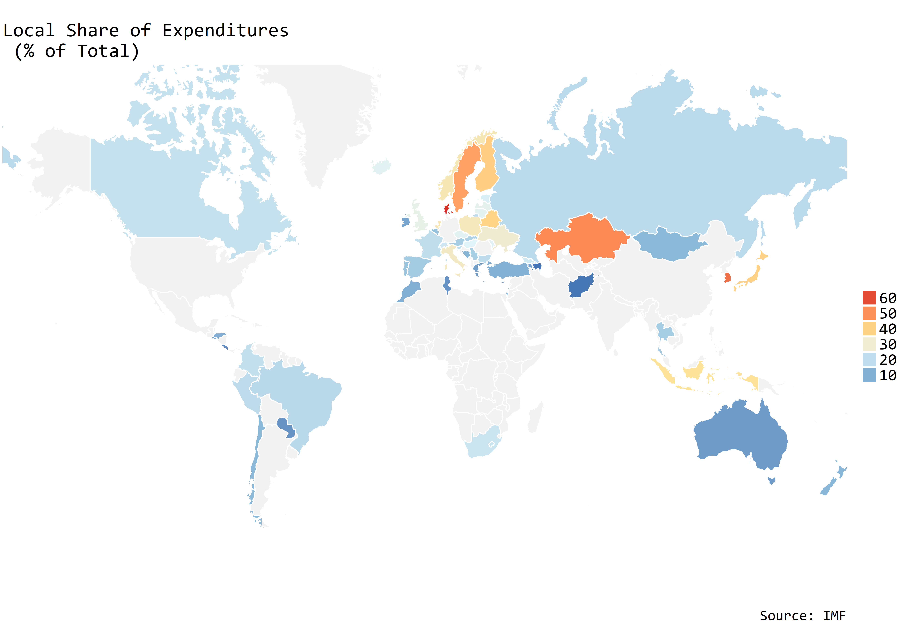
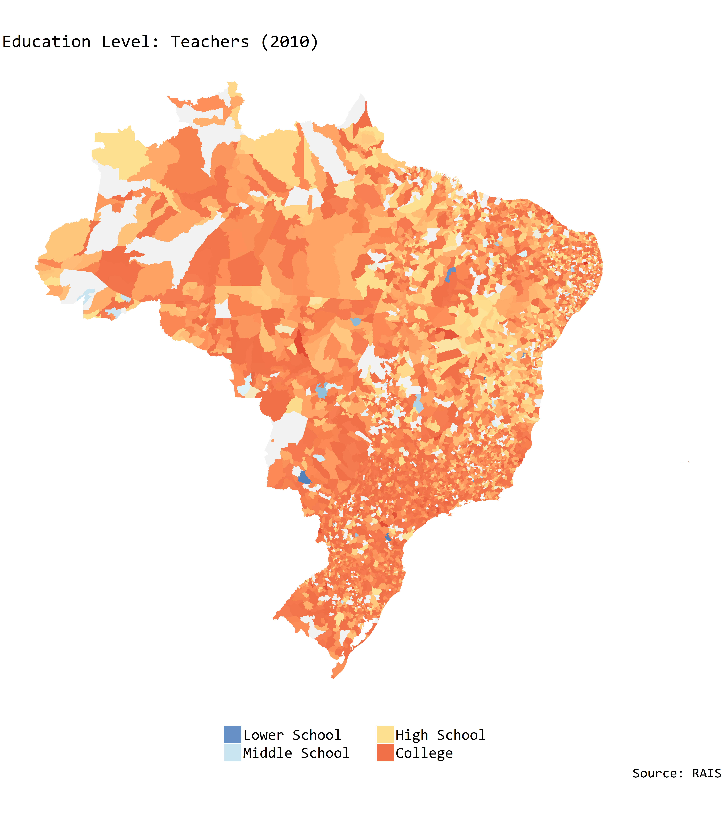
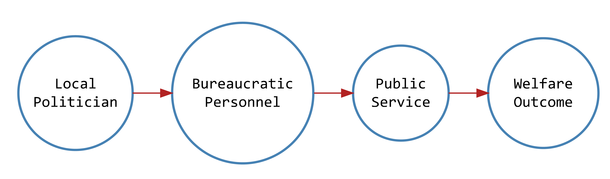

```{r setup, include=FALSE}
lapply(c("tidyverse",
         "maptools",
         "rgeos",
         "maptools",
         "ggmap",
         "scales",
         "rgdal",
         "data.table",
         "stringr",
         "foreach",
         "extrafont",
         "broom",
         "gridExtra",
         "grid",
         "DiagrammeR"), require, character.only = T)

# share common legend
grid_arrange_shared_legend <- function(..., ncol = length(list(...)), nrow = 1, position = c("bottom", "right")) {

  plots <- list(...)
  position <- match.arg(position)
  g <- ggplotGrob(plots[[1]] + theme(legend.position = position))$grobs
  legend <- g[[which(sapply(g, function(x) x$name) == "guide-box")]]
  lheight <- sum(legend$height)
  lwidth <- sum(legend$width)
  gl <- lapply(plots, function(x) x + theme(legend.position="none"))
  gl <- c(gl, ncol = ncol, nrow = nrow)

  combined <- switch(position,
                     "bottom" = arrangeGrob(do.call(arrangeGrob, gl),
                                            legend,
                                            ncol = 1,
                                            heights = unit.c(unit(1, "npc") - lheight, lheight)),
                     "right" = arrangeGrob(do.call(arrangeGrob, gl),
                                           legend,
                                           ncol = 2,
                                           widths = unit.c(unit(1, "npc") - lwidth, lwidth)))

  grid.newpage()
  grid.draw(combined)

  # return gtable invisibly
  invisible(combined)

}

# knitr options
knitr::opts_chunk$set(cache = TRUE, fig.align='center', warning = F, dpi = 300, message= F, echo = F, dev = 'png')
```

# Overview:

* Motivation.
* The case: Brazil.
* Research question.
* Extant literature and theoretical debate.
* Next steps.
* Conclusion.

# It all began...

\center
```{r, out.width = "260px"}
knitr::include_graphics("health_agents.jpg")
```

# ...in Peru.

* A journey to municipalities in the Andes.
    * Nurses $\rightarrow$ healthcare.
    * Teachers $\rightarrow$ education.
* Local service delivery.
    * Public services as administration.
    * Political decision.

# Across the world:

* Local service delivery is global.
    * Decentralization in developing and developed world. 
        * \textcolor{gray}{Falleti 2010, Ferwerda 2015.} 
    * Delegation to local governments.
        * \textcolor{gray}{Ahmad and Brosio 2008.}
    * Restructuring of public services delivery.
        * \textcolor{gray}{OECD 2016.}
    
# Delegation in the world:

```{r, out.width = "290px"}

```

# Welfare implications:
```{r, out.width = "280px", message = F, warnings = F, echo = F}
## rais data
rais.edu <- fread("~/Princeton/R/RAIS/data/consolidado/rais_mun_edu_test.csv",
                  verbose = F, showProgress = F)
rais.hcr <- fread("~/Princeton/R/RAIS/data/consolidado/rais_mun_hcr_test.csv",
                  verbose = F, showProgress = F)

## pnud
# edu
pnud.edu <- 
  fread(file = "~/Princeton/R/censo_demo_br/pnud/censo_pnud_eng.csv",
        verbose = F, showProgress = F) %>%
  filter (year == 2010| year == 2000) %>%
  left_join(., rais.edu %>% filter(year == 2010| year == 2000), by = c("mun_id", "year")) %>%
  left_join(., fread(file = "~/Princeton/R/censo_demo_br/pnud/censo_pnud.csv",
                     verbose = F, showProgress = F) %>% 
              filter(year==2010| year==2000) %>%
              select("mun_id", "year", "MORT1"), by = c("mun_id", "year")) %>%
  mutate(perc_urb = pop_urb/pop_tot*100,
         perc_rur = pop_rur/pop_tot*100,
         log.pop = log(pop_tot))

# hcr
pnud.hcr <-
  fread(file = "~/Princeton/R/censo_demo_br/pnud/censo_pnud_eng.csv",
        verbose = F, showProgress = F) %>%
  filter (year == 2010| year == 2000) %>%
  left_join(., rais.hcr %>% filter(year == 2010| year == 2000), by = c("mun_id", "year")) %>%
  left_join(., fread(file = "~/Princeton/R/censo_demo_br/pnud/censo_pnud.csv",
                     verbose = F, showProgress = F) %>% 
              filter(year==2010| year==2000) %>%
              select("mun_id", "year", "MORT1"), by = c("mun_id", "year")) %>%
  mutate(perc_urb = pop_urb/pop_tot*100,
         perc_rur = pop_rur/pop_tot*100,
         log.pop = log(pop_tot))

## fit OLS
# enrollment
fit.enroll <- lm(perc_enroll_6_17 ~ mean.edu + as.factor(year) + log.pop +
                   perc_urb + GINI + perc_ext_poor + avg_wage, data = pnud.edu)

# illiteracy
fit.illit <- lm(perc_illit_15 ~ mean.edu + as.factor(year) + log.pop + 
                  perc_urb + GINI + perc_ext_poor + avg_wage, data = pnud.edu)

# infant mortality
fit.mort <- lm(MORT1 ~ mean.edu + as.factor(year) + log.pop + 
                 perc_urb + GINI + perc_ext_poor + avg_wage, data = pnud.hcr)

# life epectancy
fit.life <- lm(life_exp ~ mean.edu + as.factor(year) + log.pop + 
                 perc_urb + GINI + perc_ext_poor + avg_wage, data = pnud.hcr)

## extract coefs and cis
# models
model <- c('fit.enroll', 'fit.illit', 'fit.mort', 'fit.life')

# loop
coefs <- 
  foreach(i = 1:4, .combine = rbind) %do%{
  get(model[i]) %>%
      tidy(., conf.int = T) %>%
      mutate(model = model[i]) %>%
      filter(term == 'mean.edu')
}

## plotting
ggplot(coefs) +
  geom_point(mapping = aes(x = model, 
                           y = estimate),
                           color = 'steelblue') + 
  geom_pointrange(aes(x = model,
                      y = estimate,
                      ymin = conf.low,
                      ymax = conf.high),
                      color = 'steelblue',
                  fatten = 3,
                  size = 1) +
  geom_text(mapping = aes(x = model,
                          y = estimate + 0.3,
                          label = c("enrollment",
                                    "illiteracy",
                                    "infant mortality",
                                    "life expectancy")),
            color = "gray30",
            family = "Consolas",
            size = 6) +
  geom_hline(yintercept = 0, 
             linetype = 'dotted', 
             col = 'firebrick') + 
  ylim(c(-1.25, 1.25)) +
  theme_minimal(base_size = 14) + 
  theme(panel.grid.major.x = element_blank(),
        axis.text.x = element_blank(),
        panel.grid.major.y = element_line(size = 0.1,
                                          color = "gray80"),
        axis.text.y = element_text(size = 14),
        panel.border = element_blank(),
        legend.title = element_blank(),
        text = element_text("Consolas")) +
  labs(x = "Welfare Outcome",
       y = "Beta Coefficient",
       caption = "Source: RAIS, IBGE, PNUD.\n \n Control for logged population, year-fixed effects, urbanization,\n income inequality, extreme poverty, average wage.") +
  ggtitle("Relationship between Education Level and \n Welfare Outcomes in Brazil: \n Municipal Teachers and Doctors")
```

# Case study:

* Brazil.
    * Primary education and healthcare under municipal jurisdiction.
        - \textcolor{gray}{Arretche 2016.}
    * Municipal autonomy over hiring decisions.
        - \textcolor{gray}{Pessoa 1988.}
    * Unique dataset of all municipal bureaucrats from 1984-2015.
        - RAIS (Annual Report of Social Information).
    
# Expenditure, local share:
```{r, fig.height= 2.5, fig.width= 4, dpi = 600}
# extract files
files.despesa <- list.files("~/Princeton/R/tesouro/data/processed/",
                            full.names = T,
                            pattern = "funcao*")

# get rid of consolidado
files.despesa <- files.despesa[!grepl(files.despesa, pattern = "consolidado")]

# read-in
despesa <- files.despesa %>%
  lapply(. %>% fread)

# extract despesa by function
# names
name <- c("estado", "municipio", "uniao")

# loop
despesa.data <- foreach(i = 1:length(despesa), .combine = rbind) %do%{
  despesa[[i]] %>%
    select(year, educacao, saude,
           educacao_e_cultura, saude_e_saneamento) %>%
    mutate_all(., as.numeric) %>%
    mutate(year = as.integer(year),
           level = as.factor(name[i]))
  }

# fixing levels
levels(despesa.data$level) <- c("uniao", "estado", "municipio")

# convert to percentage by level
# change NAs to 0
despesa.data[is.na(despesa.data)] <- 0

# calculate shares
despesa.data <- despesa.data %>%
  group_by(year) %>%
  mutate(edu.share = (educacao + educacao_e_cultura)/ sum(educacao + educacao_e_cultura) * 100,
         health.share = (saude + saude_e_saneamento)/ sum(saude + saude_e_saneamento) * 100) %>%
  ungroup()

# plot education
share.hcr <- ggplot(data = despesa.data, aes(x = as.factor(year), 
                                y = health.share,
                                color = level,
                                group = level)) + 
  geom_point() +
  geom_line() +
  theme_light(base_size = 7) + 
  theme(panel.grid.major.x = element_blank(),
        panel.border = element_blank(),
        legend.title = element_blank(),
        legend.position = "none",
        text = element_text("Consolas")) +
  scale_x_discrete(breaks = seq(2000,2015,3)) +
  labs(x = "Year",
       y = "Expenditure (%)",
       caption = " ") +
  scale_color_manual(values = c("red1", "steelblue", "springgreen3"),
                       breaks = c("uniao", "estado", "municipio"),
                       labels = c("National", "State","Municipal")) +
  ggtitle(label = "Healthcare")

# plot education
share.edu <- ggplot(data = despesa.data, aes(x = as.factor(year), 
                                      y = edu.share, 
                                      color = level,
                                      group = level)) + 
  geom_point() +
  geom_line() +
  theme_light(base_size = 7) + 
  theme(panel.grid.major.x = element_blank(),
        panel.border = element_blank(),
        legend.title = element_blank(),
        legend.position = "bottom",
        text = element_text("Consolas")) +
  scale_x_discrete(breaks=seq(2000,2015,3)) +
  labs(x = "Year",
       y = "Expenditure (%)",
       caption = "Source: Secretaria do Tesouro Nacional") +
  scale_color_manual(values = c("red1", "steelblue", "springgreen3"),
                       breaks = c("uniao", "estado", "municipio"),
                       labels = c("National", "State","Municipal")) +
  ggtitle(label = "Education")

# multiplot
grid_arrange_shared_legend(share.hcr, share.edu,
                           ncol = 2)
```

# Personnel, local share:
```{r, fig.height= 2.5, fig.width= 4, dpi = 600}
path <- path.expand("~/Princeton/R/RAIS/")

# read-in
# list files and names
file.names <- list.files(paste0(path, "data/consolidado/"), 
                         full.names = T,
                         pattern = "*_edu.csv")
level = c("municipio", "estado")

# loop
rais.edu <- foreach(i = 1:length(file.names), .combine = rbind) %do%{
  temp <- fread(file.names[[i]]) %>%
    mutate(level = level[i])
}

# get total by year
rais.edu <- rais.edu %>%
  group_by(year, level) %>%
  summarise(count = sum(total))

# graph teachers
teachers <- ggplot(data = rais.edu, aes(x = as.factor(year), 
                            y = count/1000, 
                            color = level,
                            group = level)) +
  geom_point() +
  geom_line() +
  theme_light(base_size = 7) + 
  theme(panel.grid.major.x = element_blank(),
        panel.border = element_blank(),
        legend.title = element_blank(),
        text = element_text("Consolas")) +
  scale_x_discrete(breaks=seq(2003,2015,3)) +
  labs(x = "Year",
       y = "Thousands",
       caption = "Source: RAIS") +
  scale_color_manual(values = c("steelblue", "springgreen3"),
                       breaks = c("estado", "municipio"),
                       labels= c("State","Municipal")) +
  ggtitle(label = "Teachers")

# same for healthcare
# read-in
# list files and names
file.names <- list.files(paste0(path, "data/consolidado/"), 
                         full.names = T,
                         pattern = "*_hcr.csv")
level = c("municipio", "estado")

# loop
rais.hcr <- foreach(i = 1:length(file.names), .combine = rbind) %do%{
  temp <- fread(file.names[[i]]) %>%
    mutate(level = level[i])
}

# get total by year
rais.hcr <- rais.hcr %>%
  group_by(year, level) %>%
  summarise(count = sum(total))

# let's do some boxplots
doctors <- ggplot(data = rais.hcr, aes(x = as.factor(year), 
                            y = count/1000, 
                            color = level,
                            group = level)) +
  geom_point() +
  geom_line() +
  theme_light(base_size = 7) + 
  theme(panel.grid.major.x = element_blank(),
        panel.border = element_blank(),
        legend.title = element_blank(),
        text = element_text("Consolas")) +
  scale_x_discrete(breaks=seq(2003,2015,3)) +
  labs(x = "Year",
       y = "Thousands",
       caption = " ") +
  scale_color_manual(values = c("steelblue", "springgreen3"),
                       breaks = c("estado", "municipio"),
                       labels= c("State", "Municipal")) +
  ggtitle(label = "Doctors")

# multiplot
grid_arrange_shared_legend(doctors, teachers,
                           ncol = 2)
```
# Map of Teachers:
```{r, out.width = "185px"}

```

# Research question:

\center

```{r, out.width = "270px"}

```

\justifying

* Under what conditions do local politicians hire competent bureaucrats to deliver public services?
    * Intersection of politics and public administration.
        * \textcolor{gray}{Tendler 1997, Geddes 1994.}
    * Two public services:
        * Education (teachers).
        * Healthcare (doctors and nurses).

# Extant Literature:

* Three strands of literature.
    * State capacity.
    * Developmental state and bureaucracies.
    * Clientelism/patronage.

# State capacity:

* What is the state capable of?
    * Taxation, industrialization, neither.
        * \textcolor{gray}{Tilly 1994, Kohli 2004, Van de Walle 2001.}
* State $\rightarrow$ local states.
    * Weberian state decentralized.
        * \textcolor{gray}{Falleti 2010, Eaton 2004.}
* State capacity $\rightarrow$ capacities.
    * Uneven capacities.
        * \textcolor{gray}{Skocpol 1985, Bersch et al. 2016, Centeno et al. 2017.}
        
# Developmental state and bureaucracy:

* Variation in state capacity.
    * Bureaucracy $\rightarrow$ economic development.
        * \textcolor{gray}{Johnson 1982, Evans 1995, Kohli 2004.}
    * Institutional characteristics.
        * Educated, meritocratic, depoliticized.
* Political entrepreneurship and change over time.
    * Weber's wall of separation.
        * \textcolor{gray}{Grindle 2012, Geddes 1994.}
    * Ideal type $\rightarrow$ changing institutions.
        * \textcolor{gray}{Thelen 1999, Tendler 1997.}
    
# Clientelism and patronage:

* Political motivation behind goods allocation.
    * Politicians (and voters) as strategic actors.
        * \textcolor{gray}{Stokes 2005, Stokes et al. 2015, Diaz-Cayeros et al. 2017}
* Patronage as clientelistic redistribution.
    * Public jobs to loyalists or party members.
        * \textcolor{gray}{Calvo and Murillo 2004, Hagopian 1997, Grindle 2012.}
* Patronage refined.
    * Who gets hired?
    * What qualifications?
    
# Next steps:
* From framing to testing:
    * Data gathering effort largely concluded.
    * Descriptive and causal analysis ongoing.
* Incorporating qualitative evidence.
    * Fieldwork in Brazil.
    * Explore accounts of local administrative changes.
    * Motivations and decision-making process.

# Possible mechanisms:
* Politicians decide who to hire, retain or fire.
    * Education level.
    * Type of contract (permanent or temporary).
    * Wage.
    * Work experience (years).
* Possible mechanisms:
    * Economic modernization.
    * State-society synergy.
        * \textcolor{gray}{Evans 1996}
    * Party turnover (time horizon).
        * \textcolor{gray}{Akhtari et al. 2017.}
    * Overlapping jurisdiction.
        * \textcolor{gray}{Gulzaar and Pasquale 2017.}

# Data:
* Data collection effort.
    * Demographic census.
        * Municipal level, 1980-2010.
    * Municipal budget.
        * Breakdown by function, 1998-2010.
    * Electoral data.
        * Mayoral elections from 1994 to 2014.
    * Education and healthcare infrastructure.
        * Unique Health System (SUS).
        * School census.
        
# Conclusion:

* Public service as administration.
    * Bureaucratic organization behind delivery.
* Going local.
    * Municipal governments and capacities.
    * Executive leadership and personnel.
* Build to deliver.
    * Bureaucracies as changing institutions.
    * Political decisions behind these changes.

# Thank you!

* Please send comments to \fontfamily{cmtt}\selectfont galileuk@princeton.edu.